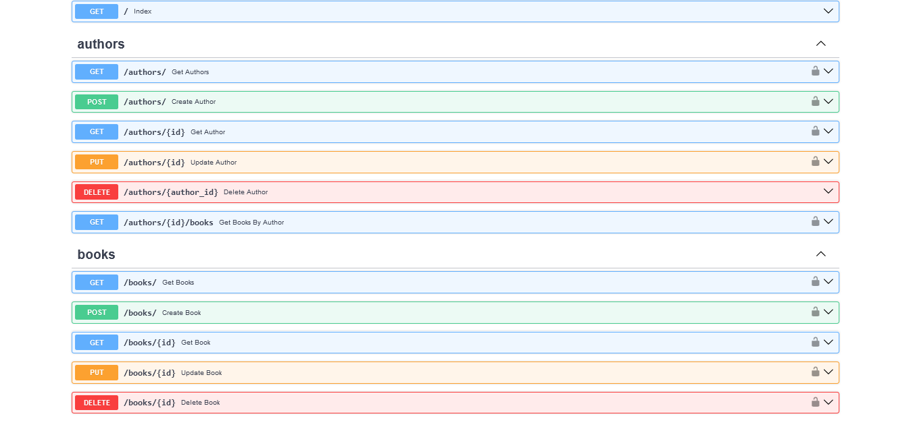
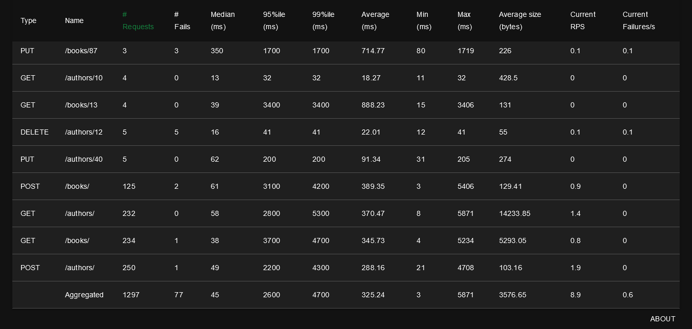

# Management Book API

This project is a RESTful API built with FastAPI, using MySQL for the database, Redis for caching, and Docker for containerization. The API allows you to manage authors and books with endpoints for creating, retrieving, updating, and deleting records.

## Table of Contents

- [Features](#features)
- [Technologies Used](#technologies-used)
- [Setup Instructions](#setup-instructions)
  - [Prerequisites](#prerequisites)
  - [Clone the Repository](#clone-the-repository)
  - [Configure Environment Variables](#configure-environment-variables)
  - [Docker Setup](#docker-setup)
  - [Database Migrations with Alembic](#database-migrations-with-alembic)
  - [Running the Application](#running-the-application)
  - [Testing the API](#testing-the-api)
- [API Endpoints](#api-endpoints)
- [Unit Testing](#unit-testing)
- [Load Testing](#load-testing)
- [Additional Notes](#additional-notes)

## Features

- **Authors Management**: Create, read, update, and delete authors.
- **Books Management**: Create, read, update, and delete books.
- **Associations**: Retrieve all books by a specific author.
- **Caching**: Optimize performance using Redis for caching.
- **Unit Testing**: Comprehensive tests for all functionalities.
- **Docker Support**: Easy setup and deployment.

## Technologies Used

- [FastAPI](https://fastapi.tiangolo.com/)
- [MySQL](https://www.mysql.com/)
- [Redis](https://redis.io/)
- [Docker](https://www.docker.com/)
- [Alembic](https://alembic.sqlalchemy.org/)
- [pytest](https://docs.pytest.org/en/stable/)

## Setup Instructions

### Prerequisites

- Install [Docker](https://docs.docker.com/get-docker/)
- Install [Docker Compose](https://docs.docker.com/compose/install/)
- Python 3.9 or higher
- MySQL server

### Clone the Repository

```bash
git clone https://github.com/andrepradika/be-management-book.git
cd be-management-book
```

### Configure Environment Variables
Create a .env file in the root directory of the project and add the following environment variables:
```bash
BEARER_TOKEN=supersecrettoken123
DATABASE_URL=mysql+pymysql://user:password@db:3306/management_book
DATABASE_TEST_URL=mysql+pymysql://user:password@db:3306/management_book_test
REDIS_URL=redis://redis:6379/0
```

### Docker Setup
Create a docker-compose.yml file in the root directory with the following content:
```bash
version: '3.7'

services:
  db:
    image: mysql:8.0
    environment:
      MYSQL_ROOT_PASSWORD: password
      MYSQL_DATABASE: management_book
      MYSQL_USER: user
      MYSQL_PASSWORD: password
    volumes:
      - db_data:/var/lib/mysql
      - ./mysql-init:/docker-entrypoint-initdb.d
    ports:
      - "3306:3306"
    healthcheck:
      test: ["CMD", "mysqladmin", "ping", "-h", "localhost"]
      interval: 10s
      timeout: 5s
      retries: 10

  redis:
    image: redis:latest
    ports:
      - "6379:6379"
    healthcheck:
      test: ["CMD", "redis-cli", "ping"]
      interval: 10s
      timeout: 5s
      retries: 5

  api:
    build:
      context: .
      dockerfile: Dockerfile
    ports:
      - "8000:8000"
    environment:
      - BEARER_TOKEN=supersecrettoken123
      - DATABASE_URL=mysql+pymysql://user:password@db/management_book
      - REDIS_URL=redis://redis:6379/0
    depends_on:
      db:
        condition: service_healthy
      redis:
        condition: service_healthy
    volumes:
      - ./app:/app/app
      - ./alembic:/app/alembic
      - ./alembic.ini:/app/alembic.ini
    command: >
      bash -c "
      alembic upgrade head &&
      uvicorn app.main:app --host 0.0.0.0 --port 8000"

  test:  # Comment if not used
    build:
      context: .
      dockerfile: Dockerfile
    environment:
      - REDIS_URL=redis://redis:6379/0
    depends_on:
      db:
        condition: service_healthy
      redis:
        condition: service_healthy
    command: >
      bash -c "pytest tests/ --disable-warnings -v"
volumes:
  db_data:
```

## Running the Application
To build and run the Docker containers, use the following command:
```bash
docker-compose up --build
```
The API will be accessible at http://localhost:8000.

## Testing the API
1. Open the Swagger UI at http://localhost:8000/docs. <br>
2. Click the Authorize button and enter your Bearer token:
```bash
secrettoken123
```
3. Test the various endpoints to manage authors and books.

## API Endpoints
Authors
* GET /authors: Retrieve a list of all authors.
* GET /authors/{id}: Retrieve details of a specific author. 
* POST /authors: Create a new author.
* PUT /authors/{id}: Update an existing author.
* DELETE /authors/{id}: Delete an author.

Books
* GET /books: Retrieve a list of all books.
* GET /books/{id}: Retrieve details of a specific book.
* POST /books: Create a new book.
* PUT /books/{id}: Update an existing book.
* DELETE /books/{id}: Delete a book.

Associations
* GET /authors/{id}/books: Retrieve all books by a specific author.



## Unit Testing
1. Ensure test in docker-compose.
<br>
2. Run tests using:
```bash
  docker-compose up --build test
```
Image Result Test


## Load Testing
1. Ensure API is running.
2. Run tests using:
```bash
  locust
```
3. Open web interface:
```bash
  http://localhost:8089
```
Image Result Locust


## Additional Notes :
1. Re-run docker image api if, database not ready
2. Re-initialize database if not accessed, you can check using:
```bash
mysql -u user -p
show databases;
```